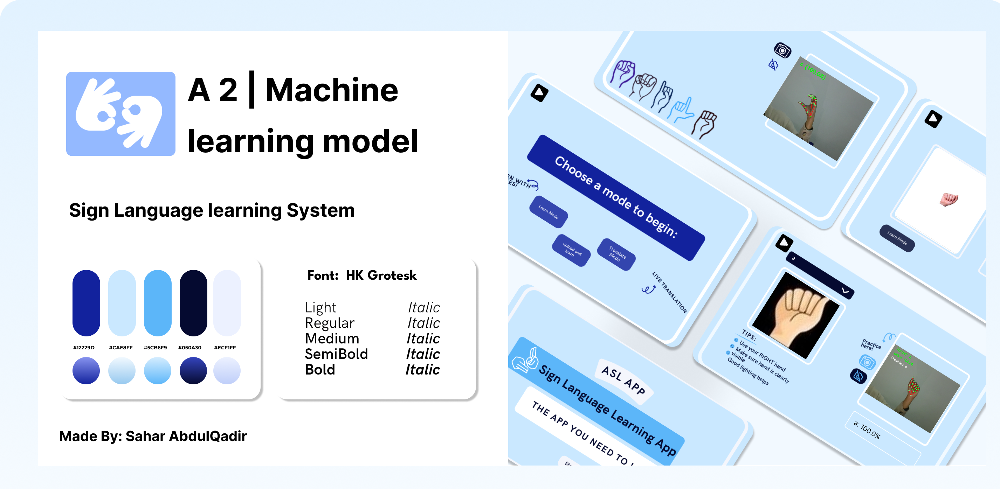

## ✎ Sign Language Learning & Translation App
## 📸 Application Demo

### ◼ Overview

This project is a Sign Language Learning and Translation Application focused on American Sign Language (ASL). The system enables real-time recognition of hand gestures and translates them into text, helping bridge communication gaps between sign language users and non-signers. In addition, the application supports learning by allowing users to practice and receive feedback on their signs.

The project applies computer vision techniques to detect hand landmarks and classify gestures efficiently in real time.

### ◼ Objectives

Enable real-time ASL gesture recognition

Translate hand gestures into readable text

Support learning and practice of sign language

Reduce communication barriers for sign language users

Explore practical applications of computer vision in education and accessibility

### ◼ Key Features

Real-time hand gesture detection using a webcam

ASL sign-to-text translation

Learning mode for practicing individual signs

Custom dataset support for adding new gestures

Model training and prediction pipeline

Lightweight and responsive system

### ◼ Technologies Used

Python

OpenCV – video capture and image processing

MediaPipe – hand landmark detection

NumPy – numerical operations

Scikit-learn – model training and evaluation

Pickle – model serialization

### ◼ How It Works

Hand Detection
The webcam captures live video input, and hand landmarks are extracted using MediaPipe.

Data Processing
Landmark coordinates are normalized and prepared for classification.

Model Training
A supervised learning model is trained on labeled hand landmark data.

Real-Time Prediction
The trained model predicts the performed sign and displays the corresponding text output.

### ◼ Performance

The system achieves strong recognition accuracy across most sign classes, with reliable real-time performance. Minor confusion may occur between visually similar gestures, but overall results demonstrate effective sign-to-text translation and learning support.
