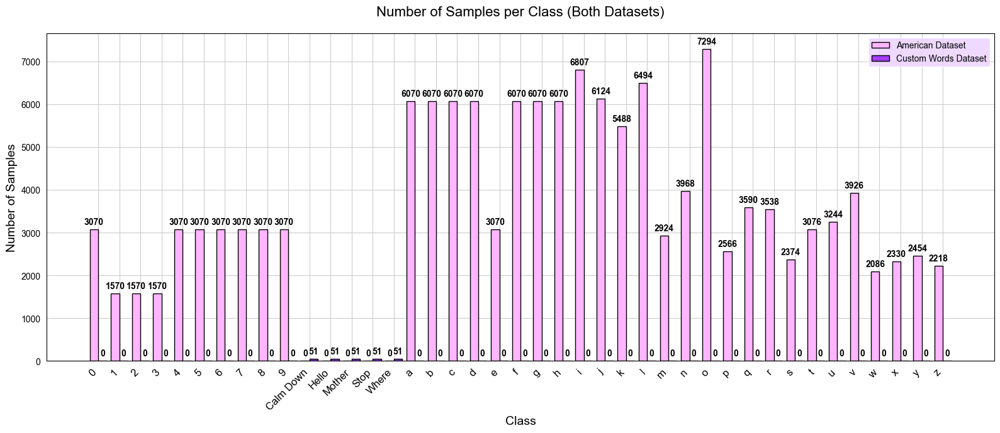
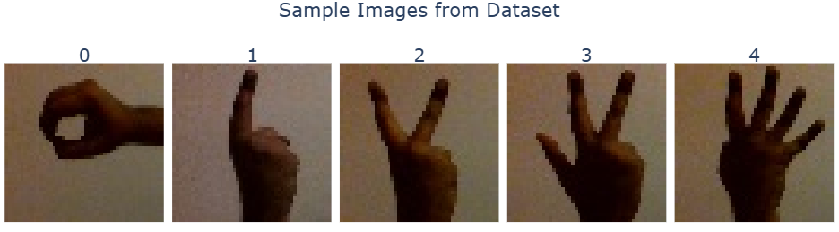
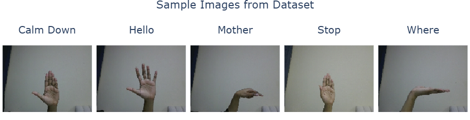
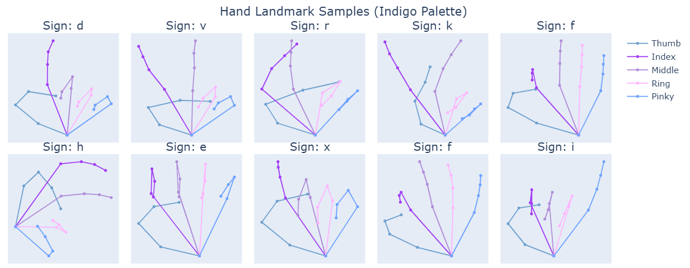
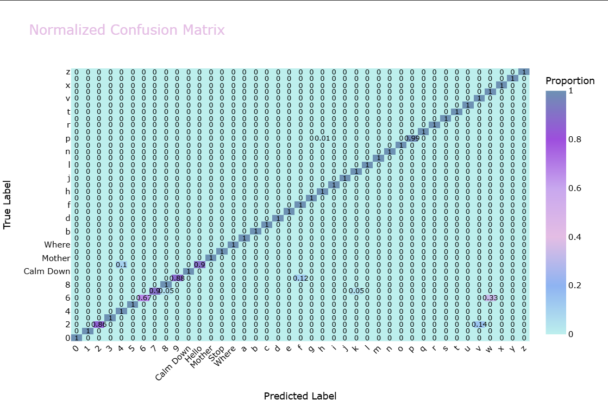
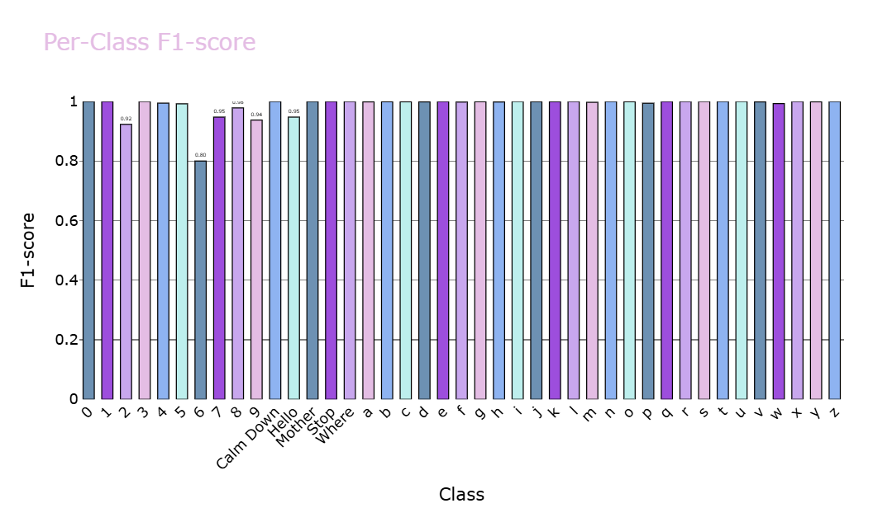

# Sign Language system – EDA & Model Evaluation Report

## 1. Overview

This report summarizes **Exploratory Data Analysis (EDA)** and **Model Evaluation** for the hand landmark sign recognition dataset. The analysis combines:

- **American dataset** (image-based signs)
- **Custom words dataset**
- **Combined landmark dataset** (21-point hand landmarks)
- **KNN classification model**

---

## 2. Dataset Summary

### 2.1 & 2.2 Overview

  <!-- COLUMN 1 : Source Datasets -->
  

  <table style="width:100%;  background:#ffffff; color:#000000; ">
      <tr style="background:#000000; color:#ffffff;">
        <th style="border:1px solid #000; padding:6px;">Dataset</th>
        <th style="border:1px solid #000; padding:6px;">Description</th>
        <th style="border:1px solid #000; padding:6px;">Link</th>
        <th style="border:1px solid #d5d1d1; background: #d5d1d1; padding:6px;"></th>
        <th style="border:1px solid #d5d1d1; background: #d5d1d1; padding:6px;"></th>
                <th style="border:1px solid #000; padding:6px;">Attribute</th>
        <th style="border:1px solid #000; padding:6px;">Value</th>
      </tr>
      <tr>
        <td style="border:1px solid #000; padding:6px;"><b>American</b></td>
        <td style="border:1px solid #000; padding:6px;">Standard sign dataset</td>
        <td style="border:1px solid #000; padding:6px;">
          <a href="https://www.kaggle.com/datasets/grassknoted/asl-alphabet"><strong>Kaggle</strong></a>
        </td>
        <td style="border:1px solid #d5d1d1; background: #d5d1d1; padding:6px;"></td>
        <td style="border:1px solid #d5d1d1; background: #d5d1d1; padding:6px;"></td>
        <td style="border:1px solid #000; padding:6px;">Landmark points per hand</td>
        <td style="border:1px solid #000; padding:6px;">21</td>
      </tr>
      <tr>
        <td style="border:1px solid #000; padding:6px;"><b>Custom Words</b></td>
        <td style="border:1px solid #000; padding:6px;">User-defined signs</td>
        <td style="border:1px solid #000; padding:6px;">Manual</td>
         <td style="border:1px solid #d5d1d1; background: #d5d1d1; padding:6px;"></td>
         <td style="border:1px solid #d5d1d1; background: #d5d1d1; padding:6px;"></td>
                <td style="border:1px solid #000; padding:6px;">Dimensions per point</td>
        <td style="border:1px solid #000; padding:6px;">(x, y, z)</td>
      </tr>
      <tr>
        <td style="border:1px solid #000; padding:6px;"><b>Landmarks</b></td>
        <td style="border:1px solid #000; padding:6px;">Numeric hand vectors</td>
        <td style="border:1px solid #000; padding:6px;">MediaPipe</td>
         <td style="border:1px solid #d5d1d1; background: #d5d1d1; padding:6px;"></td>
         <td style="border:1px solid #d5d1d1; background: #d5d1d1; padding:6px;"></td>
           <td style="border:1px solid #000; padding:6px;">Feature shape</td>
        <td style="border:1px solid #000; padding:6px;">(samples, 21, 3)</td>
      </tr>

  </table>
  

  <!-- COLUMN 2 : Landmark Data Structure -->
  

   <ul style="margin-top:8px; padding-left:18px; color:#ffffff">
      <li><b>American dataset</b> includes alphabet letters (A–Z) and numbers (0–9).</li>
      <li><b>Custom words</b> contain static word sign gestures.</li>
      <li><b>Landmarks</b> are numerical hand coordinates extracted using MediaPipe.</li>
  </ul>
  <ul style="margin-top:8px; padding-left:18px; color:#ffffff">
      <li>Each hand consists of <b>21 landmark points</b> representing key joints.</li>
      <li>Each point contains <b>x, y, z</b> coordinates in 3D space.</li>
      <li>Feature array shape is <b>(samples, 21, 3)</b> for model input.</li>
  </ul>

  

## 3. Class Distribution Analysis (EDA)

### 3.1 Number of Classes

  <!-- LEFT COLUMN : TABLE -->
  

  

      Table 1: Number of Classes per Dataset
    

   

      <table style="
        width:100%;
        border-collapse:collapse;
        background:#ffffff;
        color:#000000;
      ">
        <tr style="background:#000; color:#fff;">
          <th style="border:1px solid #000; padding:8px;">Dataset</th>
          <th style="border:1px solid #000; padding:8px;">Number of Classes</th>
        </tr>
        <tr>
          <td style="border:1px solid #000; padding:8px;"><b>American Dataset</b></td>
          <td style="border:1px solid #000; padding:8px;">36</td>
        </tr>
        <tr>
          <td style="border:1px solid #000; padding:8px;"><b>Custom Words Dataset</b></td>
          <td style="border:1px solid #000; padding:8px;">5</td>
        </tr>
        <tr>
          <td style="border:1px solid #000; padding:8px;"><b>Combined Dataset</b></td>
          <td style="border:1px solid #000; padding:8px;">41</td>
        </tr>
      </table>
    

  

  <!-- RIGHT COLUMN : IMAGE -->
  

   

      Figure 1: Samples per Class Distribution
    

   

    
    

  

  <ul style="margin:0; padding-left:16px;">
    <li>The dataset exhibits a <b>strong class imbalance</b> across gesture categories.</li>
    <li><b>Alphabet classes (A–Z)</b> dominate the dataset, with <b>thousands of samples per class</b>.</li>
    <li><b>Numeric classes (0–9)</b> contain significantly fewer samples, mostly under <b>300</b>.</li>
    <li><b>Custom word classes</b> are uniformly small, with <b>50 samples per class</b>.</li>
  </ul>

### 3.2 Sample Images from Datasets

  <!-- READY DATASET -->
  

      Ready Dataset Samples
    

      
    

  

  <!-- CUSTOM DATASET -->
  

  

      Custom Dataset Samples
    

 

      
    

  

<!-- OPTIONAL NOTES -->

  <ul style="margin:0; padding-left:16px;">
    <li><b>Ready dataset</b> samples originate from a standardized sign language dataset.</li>
    <li><b>Custom dataset</b> samples were manually collected to represent user-defined gestures.</li>
   <li>Lighting and hand orientation vary across samples</li>
<li>Some classes show high visual similarity</li>
  </ul>

## 4. Visual Data Exploration

### Hand Landmark Samples

<!-- IMAGE FULL WIDTH -->

  

<!-- NOTES BOX -->

  <ul style="margin:0; padding-left:16px; line-height:1.5;">
    <li>Visualizes <b>21 key hand landmarks</b> per sample using a <b>5-finger mapping</b>: Thumb, Index, Middle, Ring, Pinky.</li>
    <li>Helps detect <b>outliers, inconsistencies, or misaligned landmarks</b> before model training.</li>
  </ul>

## 5. Model Evaluation (KNN Classifier)

### 5.1 Normalized Confusion Matrix

  <!-- LEFT COLUMN : NOTES (smaller) -->
  

 

    <ul style="margin:0; padding-left:6px; line-height:1.5;">
        <li><b>Overall Accuracy:</b> Most classes are classified perfectly (1.0) or very close. Only a few letters/signs show minor confusion.</li>
        <li style="margin-top:8px;"><b>Minor Misclassifications:</b>
          <ul style="margin:4px 0 0 16px; padding:0;">
            <li>Class 2 → 0.14 misclassified as v</li>
            <li>Class 6 → 0.33 misclassified as v</li>
            <li>Class 7 → 0.05 misclassified as 2 and f</li>
            <li>Class 9 → 0.12 misclassified as f</li>
            <li>Class Hello → 0.1 misclassified as 4</li>
            <li>Class p → 0.01 misclassified as h</li>
          </ul>
        </li>
        <li style="margin-top:8px;"><b>Perfectly Classified Classes:</b>
          <ul style="margin:4px 0 0 16px; padding:0;">
            <li>Numerals: 0,1,3,4,5,8</li>
            <li>Common words: Calm Down, Mother, Stop, Where</li>
            <li>Letters: a, b, c, d, e, f, g, h, i, j, k, l, m, n, o, q, r, s, t, u, w, x, y, z</li>
          </ul>
        </li>
        <li style="margin-top:8px;"><b>Patterns:</b> Confusions mainly occur between visually similar hand signs (e.g., 2 vs v or 7 vs f). Numbers are recognized more reliably than letters. Custom words like Hello show slight confusion.</li>
        <li><b>Implication:</b> The model is highly accurate. Minor improvements can be made by augmenting confusing classes (2, 6, 7, 9, Hello, p) or refining features.</li>
      </ul>

 

  

  <!-- RIGHT COLUMN : IMAGE (majority width) -->
  

  

      
    

  

### 5.3 Per-Class Performance Metrics

### Per-Class Metrics – Model Evaluation

<!-- FULL-WIDTH IMAGE -->

  

<!-- NOTES BELOW IMAGE -->

  <ul style="margin:0; padding-left:16px; line-height:1.5;">
    <li>The model performs exceptionally well, with most classes hitting perfect precision, recall, and F1-scores.</li>
    <li>Classes with lots of samples, like letters <b>a–i</b> and <b>f–h</b>, are predicted flawlessly, showing the model generalizes nicely.</li>
    <li>A few classes like <b>2, 6, 9, Hello, p, w</b>have slightly lower recall or precision, probably because they have fewer examples or gestures similar to others.</li>
    <li>Custom words such as <b>Calm Down, Mother, Stop, Where</b> are recognized very accurately (F1 ≥ 0.95), great for real-world use.</li>
    <li>Even classes with very few samples (10–20) are predicted almost perfectly, showing the model learns well from limited data.</li>
    <li>Overall, the model is strong and reliable, with only minor improvements possible, like adding more data for the smaller classes.</li>
  </ul>

### 5.5 Global Metrics

  <!-- LEFT COLUMN : NOTES -->
  

   

      <ul style="margin:0; padding-left:16px; line-height:1.5;">
        <li>The model performs exceptionally well overall, achieving <b>100% accuracy</b> and a <b>weighted F1-score of 1.0</b>.</li>
        <li>The <b>macro F1-score of 0.99</b> shows that even smaller or less frequent classes are predicted almost perfectly.</li>
        <li>In short, the model is highly reliable across all classes, with minimal room for improvement.</li>
      </ul>
    

  

  <!-- RIGHT COLUMN : TABLE -->
  

 

      <table style="width:100%; border-collapse:collapse; background:#ffffff; color:#000;">
        <tr style="background:#000; color:#fff;">
          <th style="border:1px solid #000; padding:8px;">Metric</th>
          <th style="border:1px solid #000; padding:8px;">Score</th>
        </tr>
        <tr>
          <td style="border:1px solid #000; padding:8px;">Macro F1</td>
          <td style="border:1px solid #000; padding:8px;">0.99</td>
        </tr>
        <tr>
          <td style="border:1px solid #000; padding:8px;">Weighted F1</td>
          <td style="border:1px solid #000; padding:8px;">1.0</td>
        </tr>
        <tr>
          <td style="border:1px solid #000; padding:8px;">Accuracy</td>
          <td style="border:1px solid #000; padding:8px;">1.0</td>
        </tr>
      </table>
    

  

---

_Report generated from automated EDA and evaluation pipelines._
